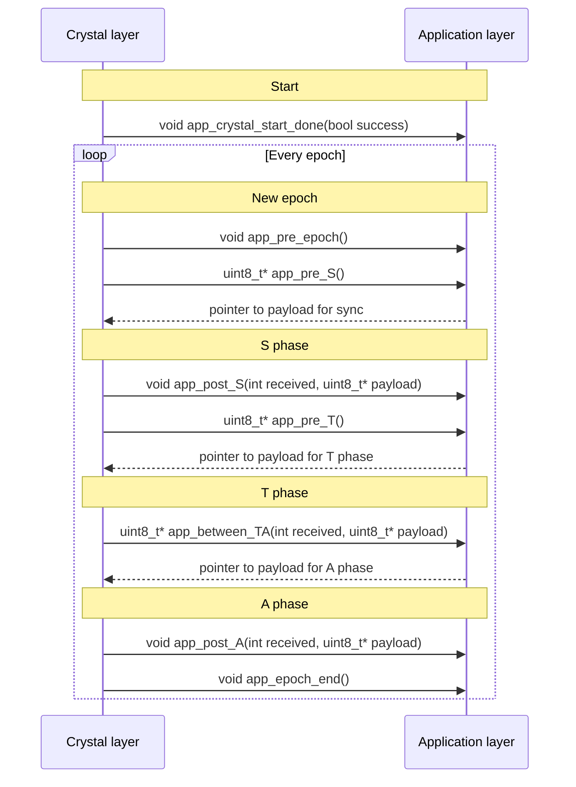

# Crystal
This folder contains a port of [Crystal](https://dl.acm.org/doi/10.1145/2994551.2994558) for Qorvo EVB1000 that was presented in our paper, ["Concurrent Transmissions for Multi-hop Communication on Ultra-wideband Radios"](http://www.ewsn.org/file-repository/ewsn2020/132_143_lobba.pdf), at EWSN2020.

## How to use it in an application
The layer interacts with the application using the following callbacks:


## Publications
This port has been published at EWSN2020 as ["Concurrent Transmissions for Multi-hop Communication on Ultra-wideband Radios"](http://www.ewsn.org/file-repository/ewsn2020/132_143_lobba.pdf) and can be cited using:
```
@inproceedings{8480038,
  author={Istomin, Timofei and Trobinger, Matteo and Murphy, Amy Lynn and Picco, Gian Pietro},
  booktitle={2018 17th ACM/IEEE International Conference on Information Processing in Sensor Networks (IPSN)}, 
  title={Interference-Resilient Ultra-Low Power Aperiodic Data Collection}, 
  year={2018},
  volume={},
  number={},
  pages={84-95},
  doi={10.1109/IPSN.2018.00015}}
```
