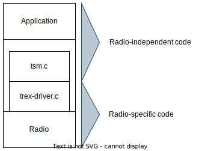

# Time Slot Manager (TSM)
TSM is a slot-based flexible engine for protocols based on concurrent transmissions (CTX), that can abstract the low-level details of radio communication, simplifying implementation. TSM allows the programmer to insert their own application logic after each single packet transmission or reception, enabling fine-grained control for protocols of any complexity.

This is a list of features that TSM provides:
- Easy-to-use synchronization between nodes
- TX/RX slots with configurable duration at runtime
- Automatic logging of the slots used at each epoch (with a viewer to visualize them)
- Use of the Qorvo DW1000's preamble timeout and frame timeout to improve the RX energy efficiency when there is no data to receive
- Energy consumption estimation through [StateTime](dev/dw1000/statetime.md)

Although the current implementation targets the Qorvo DW1000 radio, the code herein can be ported to other platforms with minimal effort making the code written on top of TSM platform-independent.
You can do so by providing a new implementation for the `trex-driver.c` file.

## TSM structure


## Slots


### Actions
Currently TSM supports the current actions:
- SCAN (Starts a reception slot with no maximum listening time)
- RX (Starts a reception slot with a maximum listening time due to preamble timeout or frame reception timeout)
- TX (Transmits the specified message)
- FLICK_RX (Listens for a Flick flood and propagates it if present)
- FLICK_TX (Acts an originator in a Flick flood)

### Examples

In the following examples, PA is the "previous action", and NA is the "next action".

Reception example: 
```c
TSM_RX_SLOT(&pt, buffer);

if (PA.status == TREX_RX_SUCCESS) {
	// Correct reception
} else if (PA.status == TREX_RX_ERROR) {
	// Received invalid packet (e.g., wrong CRC, wrong Reed Solomon, wrong PHR SECDED, SFD Timeout, ...)
} else if (PA.status == TREX_RX_TIMEOUT) {
	// Didn't receive anything
}
```

Bootstrap and synchronization example[^1]: 
```c
while (1) {
	TSM_SCAN(&pt, buffer);

	if (PA.status == TREX_RX_SUCCESS && PA.payload_len == sizeof(pkt_t)) {
		memcpy(&rcvd, buffer + TSM_HDR_LEN, sizeof(pkt_t));

		if (extra_application_checks()) {
			// Synchronize using the received packet
			NA.accept_sync = true;

			// Exit the bootstrap loop
			break;
		}
	}
}
```

Transmission example: 
```c
memcpy(buffer+TSM_HDR_LEN, &node_pkt, sizeof(info_t));
TSM_TX_SLOT(&pt, buffer, sizeof(info_t));
```

### Slots indexes
The current implementation of TSM has two slot indexes that can advance independently:
- _minislots_ which determine when the next TSM action (RX, TX, ...) will be performed and is used to correctly synchronize the nodes
- _logic slots_ which can be used by the protocol layer to more easily track in which phase of the protocol each node is

Note that as only the minislot index is transmitted with the header of the TSM packet only the minislots are obtained when receiving a packet.
You can provide a mapping between the two through the `minislot_to_slot_converter` argument a function of the `tsm_minislot_start` function.
The function should have the following signature `uint32_t minislot_to_slot_converter(uint32_t minislot_idx)`.
Note that if you do not advance manually the slots and you don't use operations with a number of slots different than the default (configurable `TSM_DEFAULT_MINISLOTS_GROUPING`) you can use `tsm_start` which will use a default mapping function.

## Flick
Flick is a special action introduced in ["Network On or Off? Instant Global Binary Decisions over UWB with Flick"]() that allows the dissemination of a binary decision quickly and efficiently. Refer to the original paper for more information.

You can see examples of how Flick can be used in our Flick-enabled implementations of [Crystal](dev/dw1000/crystal_tsm), [Weaver](examples/weaver) and a base testing application in [examples/weavent](examples/weavent)

### Examples
Flick can be used as in the following code:
```c
NA.max_fs_flood_duration = MAX_FS_LATENCY;
if (is_originator) {
	PRINT("TX_FS E %" PRIu32 , logging_context);
	TSM_TX_FS_SLOT(&pt, FS_LOGIC_SLOTS, FS_MINISLOT);
} else {
	NA.rx_guard_time = ( 2 + SNIFF_FS_OFF_TIME ) * UUS_TO_DWT_TIME_32;
	TSM_RX_FS_SLOT(&pt, FS_LOGIC_SLOTS, FS_MINISLOT);
}

if (PA.status == TREX_FS_EMPTY) {
  // If we didn't receive nor re-propagate the flood
} else if (PA.status == TREX_FS_ERROR) {
  ERR("Unexpected result from Flick");
} else {
  // Received and re-propagated the flood
}
```
Note that we set the maximum latency expected (`MAX_FS_LATENCY`) and set the number of TSM logic slots (`FS_LOGIC_SLOTS`) and the number of minislots (`FS_MINISLOT`).
The result of Flick are available through the `status` field of the `tsm_prev_action` (here shortened to `PA`) structure. The possible results are:
- `TREX_FS_EMPTY` (No Flick flood was detected or re-propagated)
- `TREX_FS_DETECTED` (A Flick flood was detected and re-propagated stemming from a preamble detection)
- `TREX_FS_DETECTED_AND_PROPAGATED` (A Flick flood was detected and re-propagated stemming from a malformed frame detection)
- `TREX_FS_ERROR` (An unexpected result happened)

## The TSM ecosystem 
```
Maybe some images or something
```

### Already available systems based on TSM
- [Weaver](examples/weaver)
- Flick
- [Crystal](dev/dw1000/crystal_tsm) with an [example](examples/crystal-test)
- [Glossy](dev/dw1000/glossy_tsm) with an [example](examples/glossy)

## Publications
- First presented and used in [Weaver](https://dl.acm.org/doi/10.1145/3384419.3430715)
```
@inproceedings{10.1145/3384419.3430715,
	author = {Trobinger, Matteo and Vecchia, Davide and Lobba, Diego and Istomin, Timofei and Picco, Gian Pietro},
	title = {One Flood to Route Them All: Ultra-Fast Convergecast of Concurrent Flows over UWB},
	year = {2020},
	isbn = {9781450375900},
	publisher = {Association for Computing Machinery},
	address = {New York, NY, USA},
	url = {https://doi.org/10.1145/3384419.3430715},
	doi = {10.1145/3384419.3430715},
	abstract = {Concurrent transmissions (CTX) enable low latency, high reliability, and energy efficiency. Nevertheless, existing protocols typically exploit CTX via the Glossy system, whose fixed-length network-wide floods are entirely dedicated to disseminating a single packet.In contrast, the system we present here, Weaver, enables concurrent dissemination towards a receiver of different packets from multiple senders in a single, self-terminating, network-wide flood.The protocol is generally applicable to any radio supporting CTX; the prototype targets ultra-wideband (UWB), for which a reference network stack is largely missing. Our modular design separates the low-level mechanics of CTX from their higher-level orchestration in Weaver. Other researchers can easily experiment with alternate designs via our open-source implementation, which includes a reusable component estimating UWB energy consumption.Our analytical model and testbed experiments confirm that Weaver disseminates concurrent flows significantly faster and more efficiently than state-of-the-art Glossy-based protocols while achieving higher reliability and resilience to topology changes.},
	booktitle = {Proceedings of the 18th Conference on Embedded Networked Sensor Systems},
	pages = {179–191},
	numpages = {13},
	keywords = {ultra-wideband, concurrent transmissions, low-power wireless},
	location = {Virtual Event, Japan},
	series = {SenSys '20}
}
```
- Used and modified in ["Network On or Off? Instant Global Binary Decisions over UWB with Flick"]()
```
...
```

[^1] This is an over-simplified example, see our systems to see better bootstrap strategies
