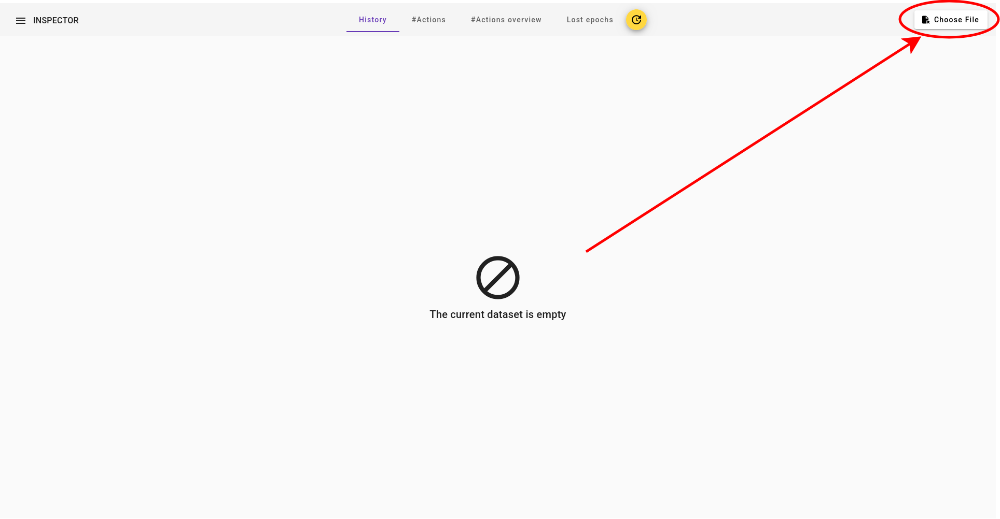
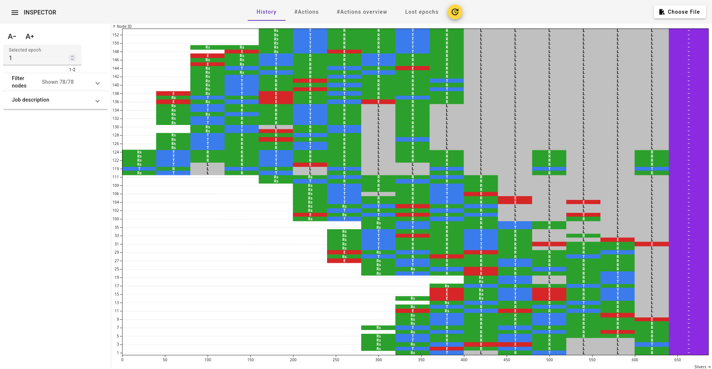

# Inspector

Inspectors enables you to visualize the protocol execution of a SAMU-based protocol.

# Installing dependencies
- Ensure the requirements are installed by running `npm install` in the root folder. 
- Check that you can see an `ng` binary (e.g., using `which ng`)

# Opening the webpage
## Option A. Quick dev webserver
To quickly run the tool you can use angular's dev webserver by running `ng serve` in the root folder.

## Option B. Build and serve with a webserver of your choosing
If you want to build to tool you can run `ng build` in the root folder. 
This will create the necessary files in the `dist/inspector` directory.
You can then serve them with a webserver of your choosing. (e.g., using `python -m http.server`)

# Formatting the logs
SAMU can only format the log of the single node.
As such Inspector expects a certain format so that it can put together the logs from multiple nodes.

The logs that you give to inspector __must__ be formatted as follows (example):
```
[2025-10-27 17:08:55,074] INFO:evb1000.16: 16.evb1000 < b"[samul 19]Slots: -iaPR#o:<A!+X.O'EPFHDujnX"
```
respecting the following regexp
```js
/^\[[0-9 :\-,]+\] INFO:[a-zA-Z0-9]+\.(?<node_id>[0-9]+): [0-9]+\.[a-zA-Z0-9]+ < b(?<sep>[\'"])\[samul (?<epoch>[0-9]+)\]Slots: (?<slots>.*)[\'"]$/
```
# Opening a log
In the top right corner of the loaded image you can click on "Choose file" and select you log, formatted as above.
Once you do that Inspector will parse the logs and visualize the protocol execution.


You can find an [example here](./example.log).
Once loaded Inspector should show this

